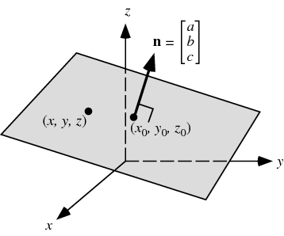

# MITx-6.86x Machine Learning with Python

## Chapters

#### Unit One: Linear Classifiers and generalisations
  * [Lecture One: Introduction to Machine Learning](https://github.com/369geofreeman/MITx-6.86x-Machine-Learning-with-Python/tree/master/week_1/lecture_1)


## Notes (cmd+f cheatsheet)

### Contents

* Formular searches
* key words
* Points and vectors
* Planes
* Loss Function
* Gradient Decent
* Chain Rule
* Matrices

## Formular Searches

* **Sigmaa/Sumnation:** summation 1, k=1..K, t=1..T
* **Limit:** lim (sin x - x)/x^3 as x->0
* **Product Notation:** 1n(product e^k, k=1..K)
* **Cos Θ:** = Adjacent / Hypotenuse


## LA / statistics of ML

* **Probability density function (PDF):** The probability density function is defined in the form of an integral of the density of the variable density over a given range. It is denoted by f (x). This function is positive or non-negative at any point of the graph and the integral of PDF over the entire space is always equal to one.

* **Gaussian distribution:** The univariate Gaussian distribution (or "normal distribution," or "bell curve") is the distribution you get when you do the same thing over and over again and average the results.
- It's formular is:
```
        1     (  (x-μ)² )
p(x) = --- exp|- -----  |
      σ√2π    (  2σ²    )


```


## Key words

* **Points:** A data point
* **Vector:** A line from the origin to a data point
* **Origin:** The n 0's of any dimentional graph
* **Norm:** Length of a vector. Using Euclidean distance the norm will be the √ of all of the vectors items.
* **Euclidean Distance:** The "ordinary" straight-line distance between two points
* **Dot Product:** How the vectors are arranged relative to each other
* **plane:** A slice through n dimensions. All the points that fit on the slice
* **hyperplane:** n-1 dimensions. A subspace whose dimension is one less than that of its ambient space. If a space is 3-dimensional then its hyperplanes are the 2-dimensional planes, while if the space is 2-dimensional, its hyperplanes are the 1-dimensional lines.
* **orthogonal:** perpendicular. the vecors are orthogonal iff their lengths are 0 (𝜋/2)
* **Unit Vector:** is a vector of length 1


## Points and Vectors

* Data points will be written as [3,2,2]. The coordinates of the plotted data point
* A vector, x. The data points are all of it's coordinates
```
Point or Vector:
     _
    |3|
x = |2|
    |2|
     -
```
* To get the index of a dimension, xi, we write it like this x1 which will = 3 in the above example.
* Adding vector together. The distance between 2 vectors (A, B), distance = (C) will be: A+C = B, C = B-A
* Vector size: Find the vector size using the norm (The √ of all of the vector items)
* The angle between two vectors: FInd the vector sizes. Next find the dot poduct of the vectors. Next, find theta (ϴ) which is the inverse of cos so:
```
 ϴ = cos⁻¹(dot product / the product of the lengths)
eg. cos⁻¹(0 / √0.25 * √0.0175) = 90
``` 
* Dot product: How the eliments are arranged relative to each other. We can find that by multiplying the relative data points:
```
The dot product (algerbraic):
     _          _        _
    |3|        |3|      |9|
x = |2| *  y = |3|  z = |6|   
    |2|        |4|      |8|
     -          -        -

When thinking about  𝑎  and  𝑏  as vectors in  𝑛 -dimensional space, we can also express the dot product as:
	𝑎⋅𝑏 = ‖𝑎‖‖𝑏‖cos𝛼
where  𝛼  is the angle formed between the vectors  𝑎  and  𝑏  in  𝑛 -dimensional Euclidean space. Here,  ‖𝑎‖  refers to the length, also known as norm, of  𝑎 :
	‖𝑎‖ = √𝑎2/1 + 𝑎2/2 + ...+𝑎2𝑛


Geometric version: x*y = |x|(norm) |y|(norm) * cosign (cos) of the angle between them
``` 

* **orthogonal vectors:** to find if two vectors are orthogonal, first find their dot product and if that = 0 (𝜋/2)  it's orthogonal 
```
        __          ____
       |a1|        | a1 |
x(1) = |a2| x(2) = |-a2 |   
       |a3|        | a3 |
       ---          ---- 
The dot product is x1(a1) * x2(a1) x1(a2) * x2(-a2) * x1(a3) * x2(a3)
It is orthogonal when 

```
* **Unit vectors:** Unit vectors are of length 1. The length of a vector is also called its norm. To find the unit vector in the same direction as a vector, we divide it by its magnitude:
```
x / norm(x)
```

* **Vector Outer product:** The outer product of two vectors produces a matrix:
```
       |x¹|
xyᵀ =  |x²|  [y¹, y², y³]
       |x³|

       |x¹y¹  x¹y²  x¹y³|
    =  |x²y¹  x²y²  x²y³|
       |x³y¹  x³y²  x³y³|
```


## Planes


<hr />

* A plane is a slice through n dimensions. 
* A typical use case for it will be to seperate data for classification (see the SVM algorithm or an example)

####  Defining a plane: 

* **A normal**: A vector in the plane in which all other points in this plane are perpendicular to this point. We will define this normal as Θ
* **An offset:** The distance from the origin to the plane. we will define this as X
```
Θ = normal 
X = offset
```

#### Hyperplane


* A hyperplane in  𝑛  dimensions is a  𝑛−1  dimensional subspace
* In general, a hyperplane in  𝑛 -dimensional space can be written as  𝜃0+𝜃1𝑥1+𝜃2𝑥2+⋯+𝜃𝑛𝑥𝑛=0.  For example, a hyperplane in two dimensions, which is a line, can be expressed as  𝐴𝑥1+𝐵𝑥2+𝐶=0 .


#### Find all of the points that fall on the plane:

* Take another point, defined as P. 
* P will only be on the plane if it is perpendicular to Θ

```
(P - X) * Θ = 0
(P * Θ) - (X*Θ) = 0
       |_______|
     P + Θ + Θo = 0

Any point that saitifies this linear relationship is on this plane
```


# Loss Function

* A way to determin how far away the model is from the data


# Gradient Distance

* Methodology for figuring out how to minimize the cost function by changing weight and bias terms throughout the network


# Chain Rule

* The chain rule is a formula to compute the derivative of a composite function


# Matrices


* **Find the product:** 
```
Produuct of a matrix by a single number:
* Times each number in the matix by teh scalar

 	|2, 3, 6|   |4, 6, 12|
  2 * = |4, 5, 6| = |8, 10, 12|
        |3, 6, 9|   |6, 12, 18|


Product of a matrix and a matrix:
* Do the dot product for each row of A onto each column of B

    |1, 2, 3|	  [7, 8]	     [58, 64]
A = |4, 5, 6| B = [9, 10]   result = [139, 154]
		  [11, 12]
so:
    1x7 + 2x9 + 3x11 = 58
    1x8 + 2x10 + 3x 12 = 154
    4x7 + 5x9 + 6x11 = 139
    4×8 + 5×10 + 6×12 = 154

```
* **When we do multiplication:**

The number of columns of the 1st matrix must equal the number of rows of the 2nd matrix.
And the result will have the same number of rows as the 1st matrix, and the same number of columns as the 2nd matrix.


<hr />


* **Find the Rank for a matrix:** The rank of a matrix is the number of linearly independent rows or columns.First get the measurement row times column (n times n if square, n times m if not square). Reduce matrix to reduced row echelon form 

* **Zero Matrix:** A zero matrix or null matrix is a matrix all of whose entries are zero.

* **Identity Matrix** An Identity matrix of size n is the n × n square matrix with ones on the main diagonal and zeros elsewhere.


