# Unit One: Linear Classifiers and generalisations

# Lecture One: Introduction to Machine Learning


## Machine Learning is everywhere:

There are numerous fields that ML is applied:

* Google uses ML to interperate your queries
* Netflix recommends movies using ML
* Alexia responds to queries using ML
* George Hotz is using ML to win level 3 in three years
* A program called AlphaGo used ML to ebat the world champion at Go


## Whats the definition of ML

```
	"Machine Learnig as a discipline aims to design, understand and aplly computer programs to learn from experience(ie, data) for the purpose of modeling, prediction or control
```

## Prediction problems


We will start our journey with some examples of the problems prediction can aim to solve.

There are many types of peroblems that ML can tackle:

### Future Events

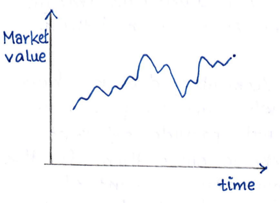

* We might want tpo predict the price of a stock/index/dirivative based on the price pattern up untill now. If we want to know the price one week, month, year into the future, ML can help with that. 

* We can also use ML to find out if a diesese will return or the likelihood of it spreading/getting worse.

* A self driving car would use ML to judge what the traffic around it might do to avoid accidents or simply to stay in lane and abide my the local laws.


### About properties we don't know

* Based on the preference of a viewer (the movies he/she saw) we can use ML to recommend movies the user might be interested in to watch nextand not show ones the user mihght dislike.

* We can predict whether a compound will be soluble in water or not

* We can train a model to tell us what an image is of or what it containes

* Translation from one lanuage to another. This is not as simple as one might first think as we need to take into account the structure of the grammer in the local dialects. ML can observe this and learn it rather than  word for word translation that will sound broken to the native speaker


### Basic idea

 - **Supervised learning**

For the beginning section of this course we will studyt supervised learning.
```
Wikipedia Says:

	Supervised learning is the machine learning task of learning a function that maps as
	input to an out put based on an example input to an output based on example input-output pairs

	It infers a function from labeled training data consisting of a set of training examples 

```

What this definition means will be clear eventually, but lets looley look at what the idea is


### A loose example: Supervised Learning

Suppose we want to train a model to to cassify an image. What this means is we willfeed the model an image and it will make a prediction of what it thinks the image is of.

Now we must first note that the machine does not have a brain of its own. We need to tell it what the possibilities of the image can be of. We will provide different categories for the model to use and have it make a prediction as to what the input image might be of. There can be many caterories for it to choose from (> 1000). This problem is called the image classification problem.

The hardcoded engernering way of accomplishing the image classification problem might be to provide specific rules for each category. For instance if we have an image of a mushroom

 

We can tell the machine that the mushroom is thin at the bottom, thick at the top and is brightly coloured at the top (usually) and dull at the bottom. 

But no matter how many ridged rules we specify, as sightly different image of a mushroom will violate the rules and it will be misclassified.

For example; Here we clearly see two mushrooms, but the machine will not be able to detect this is it is following ridged rules. 

 


Instead what we can do is something completely different. We will feed the model a number of images of mushrooms and the model will learn what a mushroom looks like. We will do this for all the categories and then ask the learned model what category the new image (that we show it after traning) belong to?

How we will accomplish this is what we will learn in the remander of the course, but the basic idea is:

* We will have a function called a classifier, denoted by k()
* the function K will take an image as input and will depend on perameters collectively denoted by 𝚯.
* With the already correct examples that we fed the model, these 𝚯 will be tuned.
* The tuned K(;𝚯) will then be used to predict the category of a new image


Similiary we can use this for translation

The problem at hand is, we want to properly translate an English sentence into Spanish. We will again follow the same idea.

* We will form a function that will somehow map English sentences to Spanish.
* We will train it parameters 𝚯 with many correct examples of proper translation.
* We will then feed our new English sentences to K(;𝚯) and see how well it performs.

Till now we can talked about things in the abstract sense. We will now see how well this translates to the mathmatical domain. What are we doing mathmatically precicely? 

### A Concrete example: Movie Recommender

From this example we will see how the mathmatical notion are written and how the problem is formulated mathmatically.


#### The problem

A user is recommended movies to watch based on the movies they had watched earlier. we want a binary answer from our algorithm (model) i.e we want to know, for a given movies, if the user will prefer to watch it (YES) or not (NO)

#### Traning set

As dicussed earler the model will learn from correct examples taht we feed it. Here for the sake of simplicity we have selected data for the following four movies.

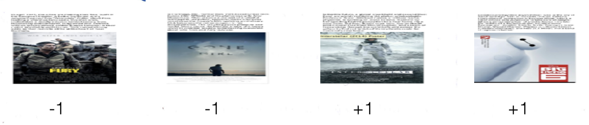


#### label: Y⁽ⁱ⁾

We can see each movies has the number +1 or -1 below it. This is the label for that particular movie.
* +1: Viewer would watch the movie
* -1: Viewer would not watch the movie

The general label from the ith movie will be denoted by
```
Y⁽ⁱ⁾
```

Seeing from the above example we can say:
```
Y⁽¹⁾ = -1, Y⁽²⁾ = -1, Y⁽³⁾ = +1, Y⁽⁴⁾ = +1
```

But where do we get these labels from? 

Maybe the viewer did a survay or maybe the view watched thge +1 movies and scrolled passed the -1 movies and Netfix recorded their prefrences.

The point is we have labels for movies that reflect viewers preferences correctly.

#### Feature vector: 𝓧⁽ⁱ⁾

Now we plan to predict the label of a new movie therefore concluding that the viewer will be recommended or not.

but what would our algorithm take as an input? It cannnot definitely be the poster of the movies as we was earlier.

we need to mathmatically encapsulate the features of any movie that wil be fed to the algorithm. therefore to each movie we associate
```
feature vector: 𝓧⁽ⁱ⁾ of the ith movie
```
and each element of the 𝓧⁽ⁱ⁾ vector will contain information related to the 𝓧⁽ⁱ⁾ movie. It depends what kind of features we want to choose for our problem

for example a typical vector can look like:
```
	    __       __
	𝓧 = | Comedy? | --> The first element will be 1 if it's a comedy, 0 otherwise
	    | Action? | --> The second element will be 1 if it's a action, 0 otherwise
	    | Romance?| --> The third element will be 1 if it's a romance, 0 otherwise
	    |    ┇    |
	    |   Imdb  | --> The last element will be a numerical imdb rating of movies
	    --       --
```

The features will be chosen by us depending on avaliability of data, importance of feature and complexity of problem.

We will denote the number of features we choose by 'd' ie we will choose d features of each movie.

Say for the second movie **Gone girl** we collect data from Imdb to find that the genre of the moview is Drama, Mystery and Thriller and the Imdb rating is 8.1/10. The feature vector 𝓧⁽²⁾ will refect this, the elements for the genre Drama, Mystery and Thriller will be assigned 1. All other genres like, comedy, action, romance etc will be assigned 0. The Imdb rating will be assigned 8.1.

It is to notwe that depending upon the formation of our problem we can see that each element can be binary, discrete or continuous.

But more generally we write:
```
	𝓧 ⋲ ℝᵈ equivalently 𝓧⁽ⁱ⁾ ⋲ ℝᵈ
```
NOte that the feature vector of any movie is of it's own property. it has nothing to do with the viewer. So when we will predict the label fo a new movie we will have with us the feature vector that we give in as input.


#### Traning set: Revisited

Now that we have clasified some terminology we can formally define what we mean by the traning set.
First note what the traning set actually is. It is a set of
```
	n: total number of cases of movies. 	With there respective feature vector

	𝓧⁽ⁱ⁾⋲ ℝᵈ: Feature vector of the ith movie.	With each movie lables correctly

	𝕐⁽ⁱ⁾: Label of the ith movie
	⋲ {+1, -1}
```

And with this data we plan tpo teach/train the machine so mathmatically.

Traning set will be denoted by Sn, where the subscript 'n' tells us the number of cases we have in the set.

the set Will contain pairs of the form (𝓧⁽ⁱ⁾, 𝕐⁽ⁱ⁾) ie feature vector and label for the ith movie.
```
	Traning set : Sn = {(𝓧⁽ⁱ⁾, 𝕐⁽ⁱ⁾), i=1,2,3...n}
	
	for example here 𝓧⁽ⁱ⁾ ⋲ ℝᵈ
			 𝕐⁽ⁱ⁾ ⋲ {+1, -1}
```

Lets now move on to forst visually see whats happening before we introduce some new terminology


### Visual / Geometric point of view

We now visually want to see whats going on. But humans in their finite imagination capabilities run into a problem.
We can't visulise points/data in more than three dimensions. Thats the limit we have. So in order to see whats happening we will reduce the dimension of our feature vector to d=2 ie our 
```
	𝓧⁽ⁱ⁾  : Will belong to ℝ²
	𝓧⁽ⁱ⁾₁ : Will be the first feature of the ith movie, which will be a real value
	𝓧⁽ⁱ⁾₂ : Will be the second feature of the ith movie, which will vbe a real value

```
These feature can be discrete valued but we are talking the most general case here.

Each movie will still have teh label 𝕐⁽ⁱ⁾ which will be denotted by
```
	+ : if the label is +1
	- : if the label is -1
```
 
With these arrangements we can now draw some sort of scatter plot to visualise the traning set:

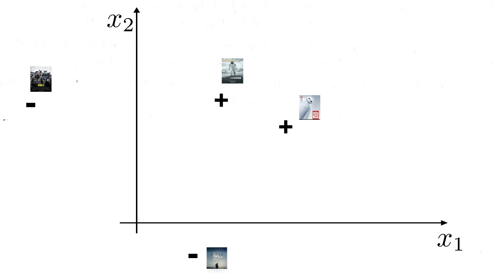

Now each of the four points above represent teh pair 
```
	(𝓧⁽ⁱ⁾, 𝕐⁽ⁱ⁾)
```

And for our example 4 points are drawn because n=4, ie thenumber of cases in the ttraning set is equal to 4.

One must note that in order to plot a point we do not need 𝕐⁽ⁱ⁾, ie the  label info for the ith movie
```
	𝓧⁽ⁱ⁾₁ : is coordinate along 𝓧 ₁  axis
	𝓧⁽ⁱ⁾² : is coordinate along 𝓧 ₂ axis
```

𝕐⁽ⁱ⁾ only comes into play when we decide whether we put '+' or '-' sign at coordinate (𝓧⁽ⁱ⁾₁, 𝓧⁽ⁱ⁾₂)

So next we move onto

#### Test Set

Now as we dicided / discussed earlier, we plan to predict whether the viewer will prefere to watch the movie, in which case it will be labelled +1 or prefere not to watch the movie, in which case it will be labelled -1

This will be done on a new set of movies disjointed from our traning set (because we cant test on data it has already seen as it will know the answer)

As the feature vector of the ith movie, is completely a property of the movie itself. This set of new movies will definitely have feature vectors. what we dont know beforehand will be their respected labels.

But as long as we know the feature evctors, we can draw the points on a scatter plot and put '?' in place of '='or '-' as labels.

This set for which our algorithm / machine predicts teh label is called the Test Set. the scatter plot is shown below


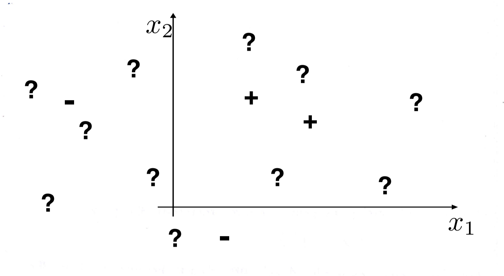


#### Classifier

Now how do we mathmatically classify label new movies with +1 or -1 labels.

The answer is functions

We will use a function also called a mapping also vcalled a classifier. here wer will refewr to it as h(), it will take as input the feature vector and spit out the label +1 or -1 according to some rule. 

this is the most general and obvious hting we can do. How do we choose h(), we'll see later but for now just understand a classifier is a function/mapping that takes elements (vectors) from the space in which features vectors live, which we denote here by 𝓧 and maps it into the categories or label space, here it's {-1,1}
```
	h : 𝓧 --> {-1, 1}
``` 
Now note that we have not constrained our classifier in any way. It can be a function for now, no matter how complicated.

what a classifier (for our example) will definitely do is divide the region 𝓧 into two parts. because each vector will either be mapped to +1 or -1. We can see some examples of this phenomenom visually.

The blue region is where our classifier labels the 𝓧 vectors insidethe region as +1, ie h(𝓧) = +1 or h(𝓧) = -1 in the white region.

Here are some examples

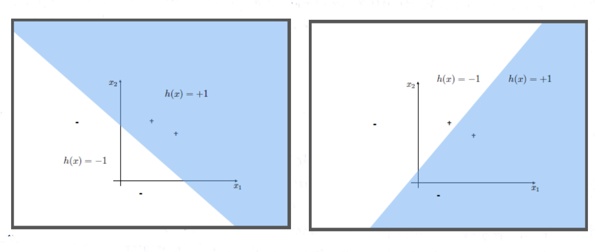


Now look at the following two classifiers

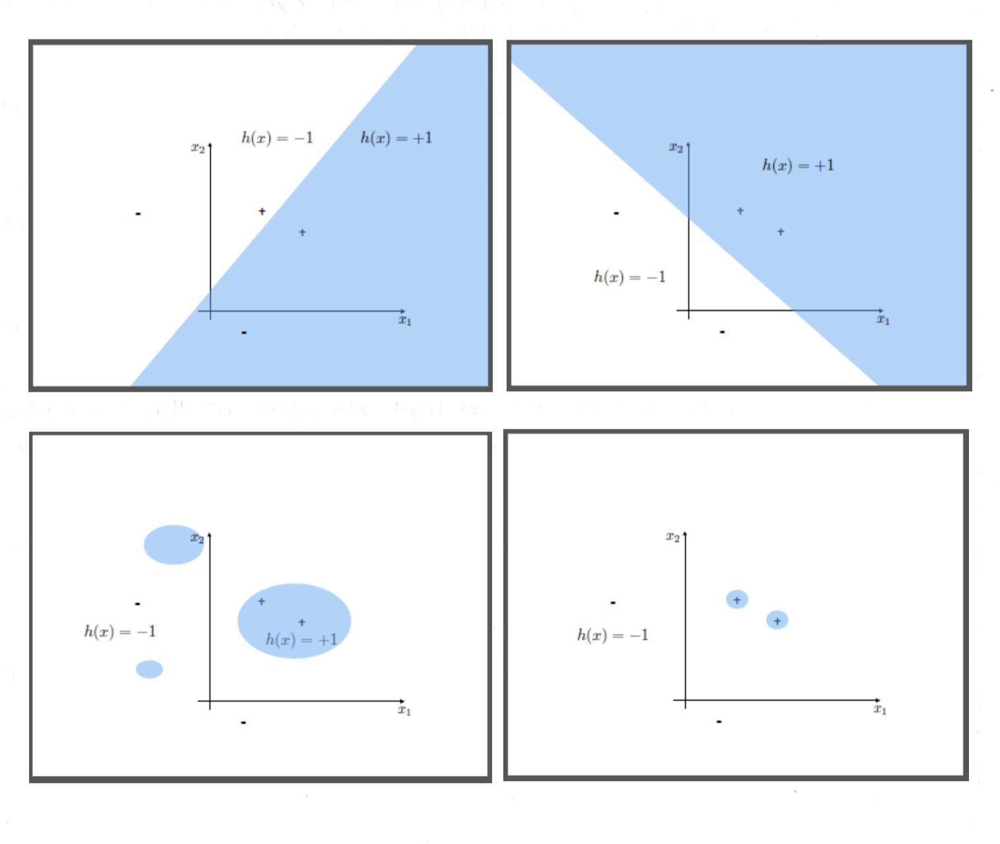


We get a feeling that something is wrong with the right one and the reason is pretty clear. if you look carefully at the right one a movie with a '-' label lies in the blue region and a movie with the '+' label lies in the white region. Which means the right above plotted classifier will misclassify these two movies which we beforhand know the label of. these movies belong to the traning set. We havent even talked about the test set yet. 

Why would we want such a classifier that labels 2 out of 4 movies wrongly when we a;ready know their correct labels.

The left classifier (plotted above) at least classifies all the examples in the traning set correctly, so intuitively it's a much better classifier than the right one.

So here we see an issue, which tells us that any classifier needs to be evaluated on the basis of how it interacts with the traning set.

We need a quantity that can be measures to the traning sert and taht is what we will study next.


### Traning Error En(h)

The idea is pretty simple. we want to see what fraction of points in teh traning set does our classifier h, classify incorrectly. we are taking points from the tranig set so we
* Have each point / vector with the label  𝕐⁽ⁱ⁾
* we will comute what our classifier predicts for  𝓧 ⁽ⁱ⁾, ie we find h(𝓧 ⁽ⁱ⁾)
* If h(𝓧 ⁽ⁱ⁾) ≇ 𝕐⁽ⁱ⁾, tehn the classifier committed an error

we will use the  double bracket in order to assign 1 or 0
```
    			/ 1 if expression TRUE
	[[ Expression ]]
			\ 0 if expression FALSE
``` 
Therefore 
```
    			     / 1 if expression TRUE
	[[ h(𝓧 ⁽ⁱ⁾) ≇ 𝕐⁽ⁱ⁾ ]]
			     \ 0 if expression FALSE
```

* We will then sum all these evaluations for each point / vector in traning data set
```
                    𝑛
	∑𝗇(h) = 1\n ∑ [[ h(𝓧 ⁽ⁱ⁾) ≇ 𝕐⁽ⁱ⁾ ]]
                   ᵢ₌₁
```

This will give us an idea of the classifiers performance wirth the traning data set.


Lets see some examples of these calculations for our examples presented previously. the formular we stated above is for general purposes. In our exmple here we dont need to keep track of notations that carefully as we deal with n = 4 case. we will just go to the 4 points and see how many of them are missclassified by h.
```
	'+' in the white region is misclassified
	'-' in the blue region is misclassified
``` 

then we divide them by 4.

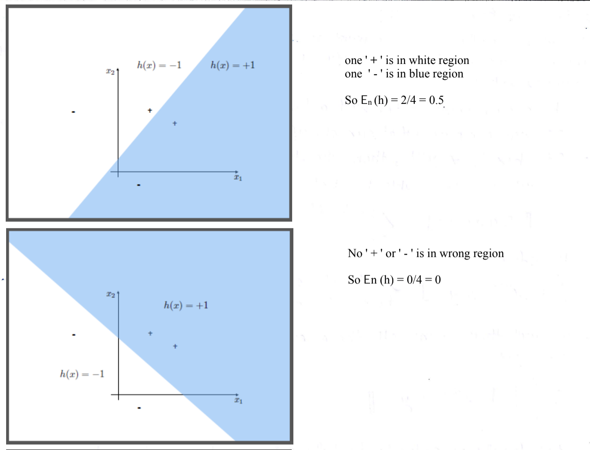

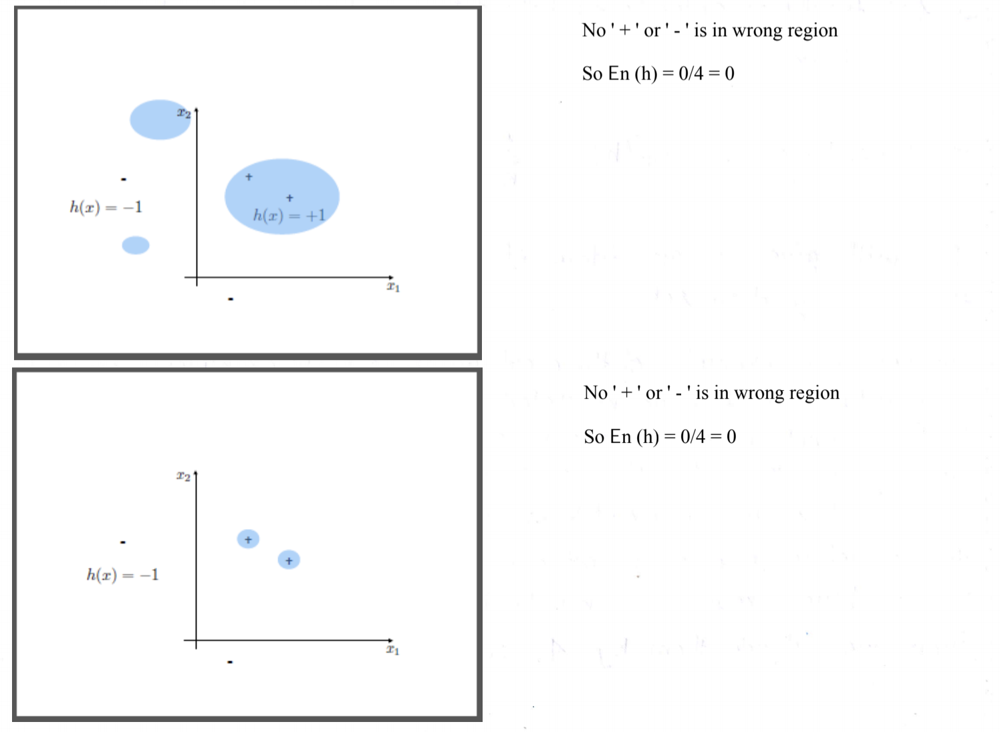


#### Genrilisation

Now look at the next three classifiers:

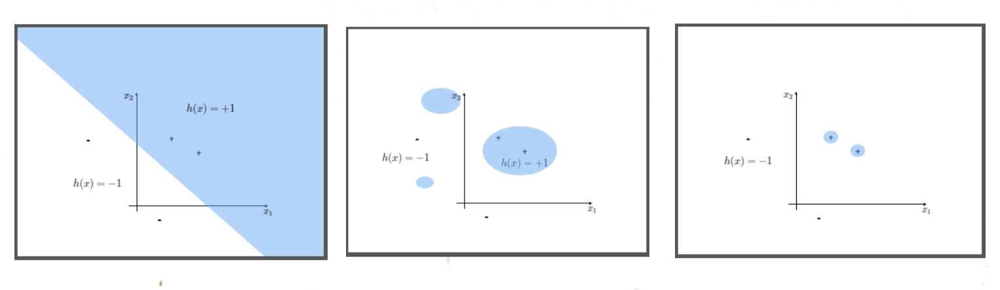

All three of them has traning error equal to 0. BUt we have a problemhere. to see that lets look at the 3rd case 

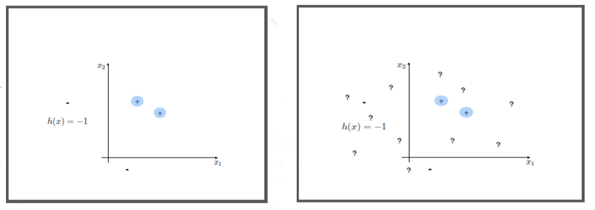

It (the classifier) works fine on the traning data but as soon as we see/plot our test case on the scatter plot, we begin to see the problem. 

The blue region of our classifier above is so narrow that only the feature vectors that are very close Iuin the bear vicinity) of the traning data examples will be labelled +1, all the others will fall into the white refion and theefore be labelled -1.

For our example above, the '?' represents points / vectors from the test set. None of them fall into the blue region due to it's narrowness. we don't have the lables of these examples beforehand, so it's a fair bet to assume that half of them will be +1 (label) in reqlity and half of them -1 (label) in reality.

If we go by this assumption we get a ball park idea of what the Test error would be. Ie what fraction of test examples will be classifier h(), misclassify and the answer is round 1/2 ie 50%

So this classifier is no better than a coin toss when it comes to predicting labels for new data. Although its test error was 0.

The issue we are facing here is genralisation. we must address the question about how well the classifier that we train on the traning set, generalise or apply correctly, similary to the test examples.

And now we want models that can genrelise from the traning set to the test set properly

But there  is a mathmatical issue here. Look at the following classifier


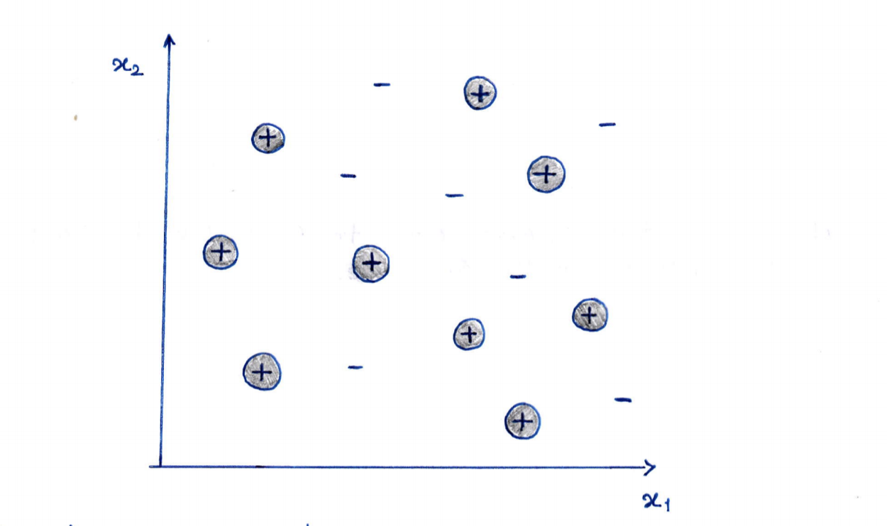


No matter how many point swe have in our traning set. i can always find a mapping h() that will wrap a small circle around my +1 vectors for every +1 labeled vector in the traning set. This will then give me a classifier h() which will have the traning error En(h) = 0 always. but this will again lead us to a coin flip prediction for each test data. This is because we were free to choose any classifier that we liked.

Define:
```
	H : Hypothesis space : The set of all possible classifiers 
```

And the problem we had this huge H that allowed us to choose any function h() of our liking.

So we improve genrelisation when we constrain H, ie we only allow our classifier to be from a limited set H and not anything we want.
Put another way the more complex set of classifiers we consider, the less likely we are to generalise.


#### Supervised Learning: Revisited

now in the next lecture we will continue our journey to explore the classifier and see how we constrain our classifier to a familyt of linear function. But before that we need to see that this idea of function h() can be used to solve many problems like

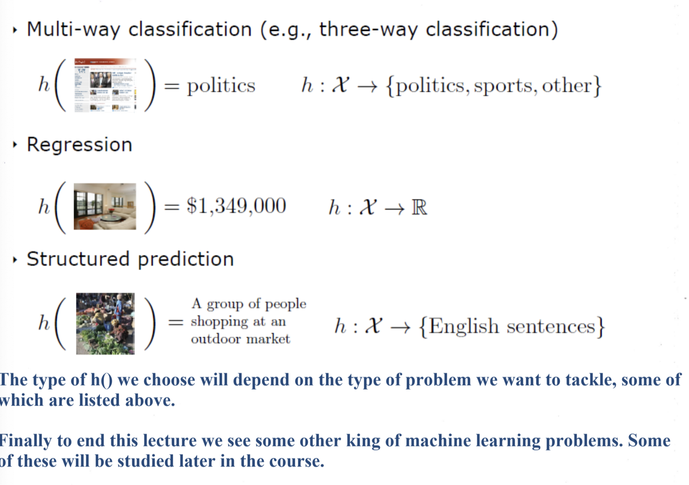

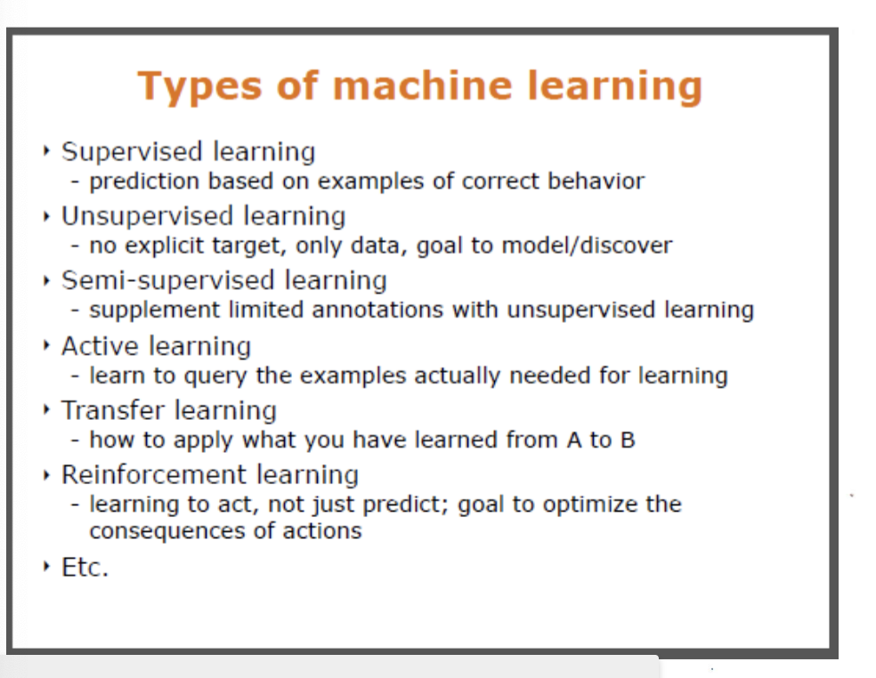


