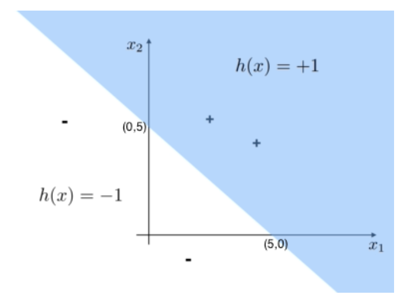

# Introduction to Classifiers: Let's bring in some geometry!

## Introduction to Linear Classifiers

Training data can be graphically depicted on a (hyper)plane. Classifiers are mappings that take feature vectors as input and produce labels as output. A common kind of classifier is the linear classifier, which linearly divides space(the (hyper)plane where training data lies) into two. Given a point  𝑥  in the space, the classifier  ℎ  outputs  ℎ(𝑥)=1  or  ℎ(𝑥)=−1 , depending on where the point  𝑥  exists in among the two linearly divided spaces.

## Linear Classifier

We have a linear classifier  ℎ  that takes in any point on a two-dimensional space. The linear classifier  ℎ  divides the two-dimensional space into two, such that on one side  ℎ(𝑥)=+1  and on the other side  ℎ(𝑥)=−1 , as depicted below.

 

Answer = +1

As an aside, classifiers need not be linear. They can be of any shape!

## Training Error

Suppose a classifier correctly classifies 5 points in the training set and 1 points in the test set. Suppose it incorrectly classifies 5 points in the training set and 2 points in the test set. What is the training error? Is it better than chance?

Answer = 0.5 equal to chance

## Hypothesis Space

What is the meaning of the "hypothesis space"?

Answer = The set of possible classifiers
