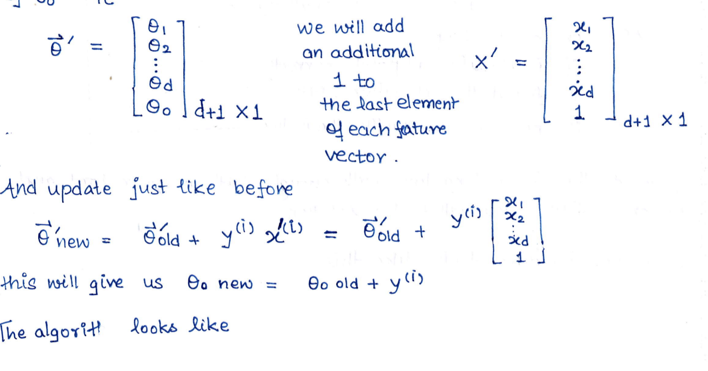

# Lecture 2: Linear Classifiers and Perceptron Algorithm

**At the end of this lecture, you will be able to**

* Understand the concepts of Feature vectors and labels, Training set and Test set, Classifier, Training error, Test error, and the Set of classifiers

* Derive the mathematical presentation of linear classifiers

* Understand the intuitive and formal definition of linear separation

* Use the perceptron algorithm with and without offseti


## Review of basic concepts

Lets start this lecture by briefly revising concepts from the previous lecture


### Feature Vector: 𝒳

Foe each and every case that we had, we had some properties that were inherent to the case. Like for eg. Every movie that we had earlier had a genre, Imdb rating, budget, cast etc.

We, for our purpose, wanted to redict something on the basis of these features. Hence for each case we chose 'd' features thar we were characteristic of that case and stacked them in a vector with each entry being a number (because that's what machines understand).

This vector for the ith movie/case was called the feature vector:
```

	𝒳⁽ⁱ⁾ = | 𝒳₁⁽ⁱ⁾ |	∈ ℝᵈ (Generally)
	       | 𝒳₂⁽ⁱ⁾ |
	       |   ┇   |
 	       | 𝒳𝑑⁽ⁱ⁾ | dx1

	𝒳ｊ⁽ⁱ⁾ : jth feature of the ith case
``` 


### Label : 𝕐⁽ⁱ⁾

This was the thing that we wanted to predict

we are talking about supervised learning here, which means we will have labelled data. (At least training data will be labelled)

To each case from the traning data we will have a label associated and for each case in the test data we want to predict the label.

For the movie example we are studying each vector which could have one of two labels.
```
		/ : Indicating viewer would watch ith movie
	𝕐⁽ⁱ⁾ = 
		\ : Indicating viewer would not watch ith movie
```


### Traning Set : Sn

Its the set of examples we feed our algorithm in order to train it. Again we are doing supervised learning which means teh traning data that we have will be labelled and we will have n examples to feed. Therefore mathmatically we write:
```
	Sn = {(𝒳⁽ⁱ⁾, 𝕐⁽ⁱ⁾), i = 1,2,3.....n}
```
Ie, set all pairs (feature vector i, label i) for all n cases

### Classifier : h()

It is simply a function or mapping from 𝒳 : ie, the space of feature vectors to the space of labels. For the movie example we had
```
	h : ℝ² --> {-1, +1} 
```

The idea was simple

We will habe a function h() that will take as input any feature vector 𝒳 and give us out a corrisponding label of +1 or -1. In order to do that we will first need to train the model. This function h() we have will infact depend on parameter 𝜣 (which can be multi-dimentional), and using the traning data, we will estimate 𝜣's to fins an optimal h().

Then we will predict lables using this optimal h().


### Traning Error En(h)

In order to see how our classifier performed with the traning data, we needed some sort of metric. The idea we had was pretty simple : Just look at what fraction of points in the traning set are misclassified by h()

So we introduced the double bracket notation:
```
	[[ Expression ]] = 1 if Expression is True
			   2 if Expression is False
```

If for the ith case in traning data
```
	h(𝒳⁽ⁱ⁾) ≠ 𝕐⁽ⁱ⁾ : Then h commited an error
	h(𝒳⁽ⁱ⁾) = 𝕐⁽ⁱ⁾ : Then h did not commit an error
```

So in order to find the fraction of the error commited we have
```
		    n
	En(h) = 1/n ∑ [[h(𝒳⁽ⁱ⁾) ≠ 𝕐⁽ⁱ⁾]]
		   i=1
```

### Test Error and test Set

Now we know what the Test Set is. it is the set of examples of cases for which we want to predict the labels. the feature vectors are as discussed earlier only a property / characteristic of the examples / cases alone. it does not matter whether the example is from the traning set or the test set, the example will always have a feature vector.

The label is the tricky part

Up untill now, we have assumed that the test data we have is unlablled. This may or may not be true.

Usually what we do while traning models is something like this:
	* We have a lot of **LABELLED** data
	* We split it into two parts **RANDOMLY**
Usually:
	* 80% is the testing data
	* 20% is the traning data

	* With the 20% traning data we train the model
	* Then we check how our trained model preforms on the test data

Here we have two things for a case in the **TEST SET** 
```
For 𝒳⁽ⁱ⁾ in the TEST SET

	The predicted label : h(𝒳⁽ⁱ⁾)
	The truth	    : 𝕐⁽ⁱ⁾ 
```

	* We can then compare these two values to finnd an error, Similar to our traning error
```
		        m
Test Error :En(h) = 1/m ∑ [[h(𝒳⁽ⁱ⁾) ≠ 𝕐⁽ⁱ⁾]]
		       i=1

	𝒳⁽ʲ⁾ : jth feature vector in TEST SET
	m    : Total cases in TEST SET
	𝕐⁽ʲ⁾ : Label of the jth case in TEST SET 

```

Now note that this will only be the possible to calculate when we have actual labels for the cases in the **Test DATA SET**, which may not  always be the case.


### Set of Calssifiers : 𝑯

This was the set of choices we had for our function h(). Ie, h ∈ 𝑯

We saw that the more choices we allowed for h(), the less generalised the model become. Ie, although we got perfect classifiers for the traning set with En(h) = 0; they failed miserably when applied to the test data

Lets also revise the geometric picture we had in mind while doing all this


### Geometric Picture

In order to anaalyse what happened geoetrically, we took
```
	n = 4  (examples in the traning set)
	𝒳 ∈ ℝ² (The feature vector was 2 dimensional)
	𝕐⁽ʲ⁾ ∈ {+1 or -1}
```


### Linear Classifiers

Althought we have talked a lot about how we plan to classify or predict teh labels, we haven't yet proposed any mathmatical form for the function h(), that is our classifier. In our lecture now, we plan to do exactly that, and we will start with the simplest family called the **Linear Classifier**. But in order to clearly understand them, we will need a mathmatical concept called hyperplane, so....


## HYPERPLANE  (Then back to the lecture)


### Lets begin with a simple case

```
	----------()--------------->
		 𝒳₀               𝒳₁ axis
```

We have a straight line above called a 𝒳₁ axis. And we have some point at 𝒳₀

what is the equasion of this point?

Thats a rather silly question but if we had to answer it, the answer would be 
```
	𝒳₁ = 𝒳₀
```
Now note what this point is doing. It's dividing the 𝒳₁ axis or line into two regions.
	* Region 1: To the right of 𝒳₀
	* Region 2: To the left of 𝒳₀
```
x : Points to the right of 𝒳₀
o : Points to the left of 𝒳₀

	--o--oo----o----o-()---x--xxx-xx--x-x-->
			  𝒳₀                 𝒳₁ axis
```

Good, now lets move on to the next case


### Lets complicate this a little 


Now we have two axis 𝒳₁ and 𝒳₂. ie, we have a second plane. We also have a line thats passes through this plane

We again ask the question, what is the equasion of this line.


We already know the equasion of a line looks like 
```
	𝒳₂ = m𝒳₁ + c

Where m is the slope and c is the intercept
```

We can write this as 
```
	𝒳₂ + m𝒳₁ -c = 0
```


But we again note a pattern here.  The Blue line divides the 2nd plane into two regions

	* Region 1 : Above the line
	* Region 2 : Below the line


	* x : Points above the line
	* o : Points below the line

Note that there will also be points exactly on the line


Good now lets us move on to the next case


### Let's complicate this a little more


Now we have 3 axis here, 𝒳₁, 𝒳₂ and 𝒳₃. This is what we call a 3rd plane. We also have a plane (in blue) And we again can ask the question what is the equasion of this plane.


The equasion of the plane is of form
```
	a𝒳₁ + b𝒳₂ + c𝒳₃ = d
```

And we can again see the pattern continued here

The plane divides the 3rd region into two parts

	* Region 1 : Above the plane points
	* Region 2 : Below the plane points


	x : Points above the plane
	0 : Points below the plane

Note that there will also be points that tie exactly on the plane and will satify the planes equasion


### So Now we cant go visually further


Because there's no way we can draw a 4d plot, But we can mathmatically translate this idea forward. before doinf that lets look at the similarites we had for our 3 examples above

Equation of:
	* Point in one dimension:    𝒳₁ - 𝒳₂ = 0 
	* Line in two dimensions:    𝒳₂ - m𝒳₁ - c = 0
	* Plane in three dimensions: a𝒳₃ + b𝒳₂ + c𝒳₁ - d = 0

So we can say if we have a dimensional sopace in general, the equasion we are looking for is off the form
```
	𝜣₁𝒳₁ + 𝜣₂𝒳₂ + 𝜣₃𝒳₃ + ........ + 𝜣ⅾ𝒳ⅾ + 𝜣ｏ = 0
``` 

Also note the following:

	in 1 dimension : dimension of point is 0
	in 2 dimension : dimension of point is 1
	in 3 dimension : dimension of point is 2

So if we are in a d dimensional space we will have the above equation as a 'd-1' dimensional thing / obgect

**Now a finall thing to note ie**

No matter which dimension d, we choose, teh equasion we wrote before divides the d dimensional space into **TWO** seperate regions and there are also points taht lie on the object that satisfy the equasion we wrote earlier. Ie, 𝜣₁𝒳₁ + 𝜣₂𝒳₂ + 𝜣₃𝒳₃ + ........ + 𝜣ⅾ𝒳ⅾ + 𝜣ｏ = 0

We are now ready to understand the concept of:


### Hyperplane


* A hyperplane in n dimensions is a n-1 dimensional subspace.
* A hyperplane seperates the space into two sides
* The equasion of a hyperplabe is:
```
	𝜣ｏ+ 𝜣₁𝒳₁ + 𝜣₂𝒳₂ + 𝜣₃𝒳₃ + ........ + 𝜣n𝒳n = 0
```

𝜣ｏ: is called the offset term

Linear algebra  provides us a great way to write the equation:
```
If we take

	    |𝜣₁ |	   |𝒳₁ |
	𝜣 = |𝜣₂ |  And 𝒳 = |𝒳₂ |
	    | ┊ |          | ┊ |
	    |𝜣∩ |nx1       |𝒳∩ |nx1
```

Then we use the dot product (𝜣ᵀx or 𝜣﹒x) to write the eqation of the hyperplane as
```
	𝜣ｏ+ 𝜣﹒x = 0
```


Now in light of this new formulation, lets look at our old examples

	* Point in one dimension:    𝒳₁ - 𝒳₂ = 0 ; 𝜣₁𝒳₁ + 𝜣ｏ= 0  ⟹  𝜣₁ = 1. 𝜣ｏ= -𝒳₀
	* Line in two dimensions:    𝒳₂ - m𝒳₁ - c = 0  ; 𝜣₂𝒳₂ + 𝜣₁𝒳₁ + 𝜣ｏ = 0 ⟹  𝜣₁ = -m, 𝜣ｏ= -c
	* Plane in three dimensions: a𝒳₃ + b𝒳₂ + c𝒳₁ - d = 0 ; 𝜣₃𝒳₃ + 𝜣₂𝒳₂ + 𝜣₁𝒳₁ + 𝜣ｏ= 0
					ie, 𝜣₁ = c, 𝜣₂ = b, 𝜣₃ = a. 𝜣ｏ= -d


Now one more thing before we end this topic


Lets first see the case of line in 2d 


The eqation of line is 𝜣₁𝒳₁ + 𝜣₂𝒳 + 𝜣₂ = 0


 


Which menas any vector thats along the direction of AB is pependicular 𝜣 vector.

Similary for the case of plane in 3d we have


Therefore we can conclude for a hyperplane in n dimensions with equation
```
	𝜣ｏ+ 𝜣₁𝒳₁ + 𝜣₂𝒳₂ + ..... +  𝜣n𝒳n = 0

Or

	𝜣ｏ+ 𝜣﹒x = 0
```

The vector 𝜣 will be orthagonal to any vector that lies on this hyperplane, ie lives in the subspace defined by the hyperplane


Now back to the lecture


## Linear Classifiers

Ok now we are ready to study our first linear classifier mathmmatically. And the problem we had in  mind is the movie recommender, where a movie from a test data set will be assigned either a +1 or -1 label.

We already know what a classifier does for our problem. It divides the space where 𝒳 ∈ ℝᵈ live into two regions. (For our example we had the blue region and the white region)

But the study of hyperplanes earlier, revealed that it too does the same thing. A hyperplane in n dimensionsis a n-1 dimensional subspace that divides the n dimensional space into two regions.

So as our first classifier, why don't we use the help of a hyperplane in order to find our classifier h()?

And we will indeed do exactly that. We will now tackle the movie recommender problem, using hyperplane's help in forming a classifier.

Now note that a hyperplane is actually just a line, when we are in 2 dimensional space. We decided earlier to keep things simple, that the feature vector for the ith movie 𝒳⁽ⁱ⁾ will have two features ie, 𝒳⁽ⁱ⁾ ∈ℝ² so our hyperplane will be a line in our example.

However the mathmatical formulation that we will use or derive will be applicable for any problem of two-class classification, with a general feature vector 𝒳⁽ⁱ⁾ ∈ ℝᵈ

We may not be able to visualise it when d > 3 but the mathematical ideas will remain the same


## The idea

we have 𝒳⁽ⁱ⁾ ∈ ℝ². Ie, the feature vectors are 2 dimensional. So we need to divide the ℝ² plane in 2 regions, using a line


Now the general equation of a line is 
```
	𝜣₁𝒳₁ + 𝜣₂𝒳₂ + 𝜣₀ = 0
```

This line here is called the **DECISION BOUNDRY**. A common machine learning term.

In general d dimensions of the hyperplane will be called the decision boundry.

Ok, now in order to carry our analysis forward, we will first simplify the math a bit. We will let the desision boundry pass through the origin.


 

We will later see the general case but first lets see this one

If that is the case then point (0,0) should satisfy the equation. 
```
	Ie, 𝜣₁﹒0 + 𝜣₂﹒0 + 𝜣₀ = 0

	⟹  𝜣₀ = 0
```
So the odffset term 𝜣₀ is 0

The equation of the line becomes
```
	𝜣₁𝒳₁ + 𝜣₂𝒳₂ = 0
```

Decission boundry passing through the origin


###  Now lets move a step further

Now we want to look at the vector 𝜣. As we know that vector 𝜣 is orthagonal to the hyperplane (line in this case).
The real direction of 𝜣 will become clear when we actually know the numerical values of its components. But for nowwe have two choices, we can either choose option A or option B. We choose option A (either A or B it doesn't matter).


But note that these two directions are the only choices we have as these are the only directions orthagonal to the lline.


**Img 1**

Here we see two vectors that lie on region. By definition of the dot product

	0﹒x = ||0|| ||x|| cos(< bw the two)
	0﹒x = ||0|| ||x⁽¹⁾|| cos 1
	0﹒x = ||0|| ||x⁽²⁾|| cos 2

As long as the vector x lies in region. The angle between will be between 0 to ∏/2 therefore
```
	𝜣﹒x > 0 for all x in region 1
```

<hr/>

**Img 2**

Here we see two vectors that lie on region 1. By definition of the dot product

	0﹒x = ||0|| ||x|| cos(< bw the two)
	0﹒x⁽³⁾ = ||0|| ||x⁽³⁾|| cos 3
	0﹒x⁽⁴⁾ = ||0|| ||x⁽⁴⁾|| cos 4

As long as the vector  x lies in region 2. The angle between will be between ∏/2 to ∏ therefore
```
	𝜣﹒x < 0 for all x in region 2
```


So now we have a new insight

We had the decission boundry 𝜣﹒x = 0 passing through origin and we know that it derives the space into two regions.
The vectors that lie on the side towards which 𝜣 points will have a dot product ie, 𝜣﹒x > 0 for x along  𝜣's side

The vectors that lie on the side towards opposite to which 𝜣 points will have a negative dot product, ie 𝜣﹒x < 0 for x opposite to 𝜣's direction.

With this insight we can develope a classifier as follows

* We need a classifier h such that
```
	h : ℝ² ⟹  {+1, -1}
```
* Ie, it should give output +1 or -1
* Why don't we just take the sign of the innerproduct 𝜣 ﹒x for a vector x lying in ℝ²
```
	h(x;𝜣) = sign(𝜣 ﹒x)
```
* This is equivalent to saying that h classifies all vectors in region 1 as +1 and region 2 as -1


So to conclude
```
	Decission Boundry 𝜣 ﹒x = 0
	Classifier: h(x;𝜣) = sign(𝜣 ﹒x)
```

Now here we will see a degree of freedom that we still have


## A degree of freedom unused

Now look at the expression of the decission voundry
```
	𝜣 ﹒x = [𝜣₁ 𝜣₂]|X₁| = 𝜣₁X₁ + 𝜣₂X₂ = 0
                       |X₂|
```
What happens if I change 𝜣 to say 25𝜣?
```
	𝜣 ﹒X = [25𝜣₁, 25𝜣₂]|X₁| = 25(𝜣₁X₁ + 𝜣₂X₂)
                            |X₂|

				⟹    𝜣₁X₁ + 𝜣₂X₂ = 0
```


Which menas the equation of decvision boundry is still the same and this is not true only for 25𝜣 but any c𝜣 where c ∈ℝ.

The point here is as long as 𝜣 is replaced by some multiple of 𝜣, the decission boundry remains the same.

This is also true for the classifier
```
	h(X;𝜣) = sign(𝜣 ﹒X)
```
if c is some real positive number then
```
	h(X;c𝜣) = sign(c𝜣 ﹒X) = sign(𝜣 ﹒X) = h(X;𝜣)
```

So all mathematical formulation we saw until now will not get affected if we use 𝜣 of c𝜣 where c ∈ ℝ+

This is a degree of freedom we have , ie we are free to choose any positive multiple of 𝜣, and our decission boundry and classifier will remain the same

But note that if 𝜣 is replaced by c𝜣 ﹒The norm of vector change
```
ie 
	||𝜣|| = √𝜣₁² + 𝜣₂²
	
	||c𝜣|| = √c²𝜣₁² + c²𝜣₂² = |c| ||𝜣||
```

So the additional degree of freedom we have relates to the norm of the 𝜣 vector, which we havent fixed up until now.

We will later see in lecture 3 that this norm will help us to form what is called large margin classifiers. But thats later

First lets generalise for the case of any line and not just the line passing through the origin.


### The general case 𝜣₀ ≠ 0


If you don't wnat to be bothered with some redious calculation you can skip this part and, assume yourself that the classifier for this case will be similary defined, but if you're curious heres whats happening


* The equation of the line is 𝜣₁X₁ + 𝜣₂X₂ + 𝜣₀ = 0
* We for some reason want to find the distance of origin to the line
* We draw a vector starting from origin and ending at the line, orthagonal to the line
* If it's orthagonal to the line this can be written as ℷ->𝜣 (lim)
* So point A or -> = ℷ->𝜣 where ℷ∈ℝ
* This means 0->A = ℷ->𝜣 = [ℷ𝜣₁, ℷ𝜣₂]ᵀ
* If point A lies on the line then it must satisfy its equation therefore 𝜣₁(ℷ𝜣₁) + 𝜣₂(ℷ𝜣₂) + 𝜣₀ = 0
* From here we find ℷ = -𝜣₀/𝜣₀₁² + 𝜣₂² = -𝜣₀/||->𝜣||²   ----(A)
* SO the perpenducular distance of the origin(0,0) from line is ||->0A|| = ||ℷ->𝜣|| = ||->𝜣|| = |𝜣₀|/||->𝜣||   ------(B)
* Now we note due to our construction 𝜣₀ is negative because ℷ->𝜣 can only  be along ->𝜣's direction if ℷ is possitive, otherwise it will be to the opposite direction.
```
And we found 
		ℷ = -𝜣₀/||->𝜣||² ⟹  𝜣₀ is negative
```


* Now everything is ready lets look at
```
	->𝜣 ﹒->X + 𝜣₀
```
We know ->𝜣 ﹒->X = ||->𝜣|| ||->X|| cos <, so above equasion becomes
```
	||->𝜣|| ||0->X|| cos< + 𝜣₀	; Lets take ||->𝜣|| outside

	||->𝜣|| (||->𝜣||cos< + 𝜣₀ / ||->𝜣||

```

We also know 𝜣₀ is negative due to our construction so we can write it as -|𝜣₀|

* So ->𝜣 ﹒->X + 𝜣₀ finally becomes
```
	||->𝜣|| (||->X||cos< - |𝜣₀| / ||->𝜣||
```


So this is 
```
	||->X|| cos< : Projection of any vector X along ->𝜣's direction

	|𝜣₀| / ||𝜣|| : Prependicular distance of origin to the line derived before eq(B)
```

For any vector X in Region 1:
```
	||->||cos< > |𝜣₀|/||->𝜣|| therefore sign (->𝜣 ﹒->X + 𝜣₀) > 0
```

For any vector X in Region 2
```
	||->||cos< < |𝜣₀|/||->𝜣|| therefore sign (->𝜣 ﹒->X + 𝜣₀) < 0
```

Therefore we can generalise our classifier
```
	Desision Boundry : 𝜣 ﹒X + 𝜣₀ = 0
	Classifier h(X;𝜣;𝜣₀) = sign(𝜣 ﹒X + 𝜣₀)
```

Now we have our first classifier


## Constraints of our classifier


Although we have a classifier, this does not mean we can classify properly. What I mean to say is , the linear classifier that we made just now is nothing more than a line in 2d.
Why would it solve every problem of two-category classification that we throw at it?

The point here is there is a small category of problems that our linear classifier above could tackle properly.

If we have our traning data, theres no guarantee that all points would be classified properly. Lets see this visually

**Img 1 and Img2**


**Img 1**
Here we have some traning data. we see there can be many lines through origin that can classify each point properly.

Some are drawn

**Img 2**
Here we see some traning data. 
We see there can bve no line through origin that correctly classifies all the points.
But there still can be many lines, ie linear classifier that can do our job.

Some are drawn

**Img 3 and Img 4**


**Img 3**
No matter how hard we try we will never be able to find a line, ie a classifier that classifies all the traning points correctly. And we are just using 4 examples in 2 dimensions here.

**Img 4**

Every possible line we try fails. It's not possible. And this brings us to the topic of linear seperability of a set that we will study next.


## Linear Seperation

So we saw earlier, that in order to find a classifier that is LINEAR, and classifies ALL the points in the traning set correctly, we will need some condition to be satisfied and that condition is the following:

```
Definition:

	Traning examples Sn = {(x⁽ⁱ⁾,y⁽ⁱ⁾}), i = 1,....,n} are linearly seperable if there exists a parameter vector 𝜣(hat) and offset parameter 𝜣(hat)₀ such that y⁽ⁱ⁾(𝜣(hat) ﹒x⁽ⁱ⁾ + 𝜣(hat)₀)>0 for all i = 1,.....,n.
```

Lets understand this properly

First understand this term : y⁽ⁱ⁾ (𝜣(hat) ﹒x⁽ⁱ⁾ + 𝜣(hat)₀)


1) (+) :  when feature vector with +1 label lies on the opposite side of desission boundry with 𝜣(hat) vector

* Then : y⁽ⁱ⁾ = +1 ; 𝜣(hat) ﹒x⁽ⁱ⁾ + 𝜣₀ = negative
* Therefore : y⁽ⁱ⁾ (𝜣(hat) ﹒x⁽ⁱ⁾ + 𝜣₀) < 0 : MISCLASSIFIED

2) (-) : when feature vector with -1 label lies on the opposite side of the dessision boundry with 𝜣(hat) vector

* Then  : y⁽ⁱ⁾ = -1 ; 𝜣(hat) ﹒x⁽ⁱ⁾ + 𝜣₀ = negative
* Therefore :  y⁽ⁱ⁾ (𝜣(hat) ﹒x⁽ⁱ⁾ + 𝜣₀) > 0 : CORRECTLY CLASSIFIED


3) (+) : when feature vector with +1 label lays on the same side of the desission boundry with 𝜣(hat) vector

* Then  : y⁽ⁱ⁾ = +1 ; 𝜣(hat) ﹒x⁽ⁱ⁾ + 𝜣(hat)₀ = Possitive
* Therefore :  y⁽ⁱ⁾ (𝜣(hat) ﹒x⁽ⁱ⁾ + 𝜣(hat)₀) > 0 : CORRECTLY CLASSIFIED

4) (-) : When the feature vector with -1 label lays on the same side of desision boundry with 𝜣(hat) vector


* Then  : y⁽ⁱ⁾ = -1 ; 𝜣(hat) ﹒x⁽ⁱ⁾ + 𝜣(hat)₀ = Possitive
* Therefore :  y⁽ⁱ⁾ (𝜣(hat) ﹒x⁽ⁱ⁾ + 𝜣(hat)₀) < 0 : MISCLASSIFIED


So finally we get the following

* When a vector is MISCLASSIFIED : y⁽ⁱ⁾ (𝜣(hat) ﹒x⁽ⁱ⁾ + 𝜣(hat)₀) < 0
* When a vector is correctly CLASSIFIED : y⁽ⁱ⁾ (𝜣(hat) ﹒x⁽ⁱ⁾ + 𝜣(hat)₀) > 0

So when in the definition of linear seprability we said
```
	y⁽ⁱ⁾ (𝜣(hat) ﹒x⁽ⁱ⁾ + 𝜣(hat)₀) > 0 for all i=1,2,3,....,n
```

we are saying that the line (or hyperplane) classifies all the points in the traning set correctlyso the definition can be boiled down to :

**DEFINITION**

A set Sn = { (x⁽ⁱ⁾, y⁽ⁱ⁾), i=1,2,3,...,n } are linearly seperable if we can find 𝜣(hat) and 𝜣₀, ie parameter vector and offset parameter that seperate them. ie, if we can find a line that seperates all points correctly that is redundant

And if we look at it closely, it absolutely says nothing at all. it just says you can correctly classify all points using a linear classifier if you can find a linear classifier that can do that.

But thuis definition is needed for the next algorithm that we are about to  see called the perceptron, which relies on the fact that a solution will be found for 𝜣(hat) vector and 𝜣₀ offset parameter on if Sn i slinearly seperable. 
But forst lets calculate traning error in this case


## Traning Error for Linear Classifier

we earlier defined traning error as the fraction of points in the traning set that were misclassified. here fior the case of linear classifier we can say that
```
	h(x⁽ⁱ⁾) = 𝜣 ﹒x⁽ⁱ⁾ + 𝜣₀
``` 
We also figured out that irrespective of the label {+1 or -1} 
```
if
	y⁽ⁱ⁾(𝜣 ﹒x⁽ⁱ⁾ + 𝜣₀) > 0 then point is correctly classified
	y⁽ⁱ⁾(𝜣 ﹒x⁽ⁱ⁾ + 𝜣₀) < 0 then point is missclassified
```

we will also consider this case as an error because we really don't know how to classify it.

If you remember the [[ ]] double bracket notation we had
```
	[[EXPRESION]] = 1 if expression true
			2 if expression False
```

For all errors
```
	y⁽ⁱ⁾(𝜣 ﹒x⁽ⁱ⁾ + 𝜣₀) ≦ 0 will be true
```

Therefore we can write


Now we will finally see the perception algorithm that finds a linear classifier, if one exists.
Ie, it will find a classifier if the traning set Sn that we have is lineraly seperable. This will  not be a unique classifier as there may be many other LINEAR classifiers that can accomplish this job.

Lets see it


## Perceptron

Instead of laying the algorithm on you, we would rather see how it comes to us geometrically. Now note that we are here in search of a line, but it is totally decided, once we have vetor 𝜣

Also note that we will seethe caseof line passing through origin, just for simplicity.

Also in prder for this algorithm to be successful, we need linearly sseprable data, ie we will need points that can be divided/classified by a line

The plane/line/decision boundry will be perpendicular to the 𝜣 vector always.

Let us begin


We can also see that the new point x⁽⁵⁾ is not correctly classified according to the current ->𝜣. So we will have to update it.

Now just forget for one second verything up until now and answer this. What would ->𝜣 be if only point x⁽⁵⁾ existed?

the answer is it would have been a vector from origin to x⁽⁵⁾ but with a negative sign because we wont feature vectors with label -1 to point away from them so
```
	->𝜣 would have been y⁽ⁱ⁾ ﹒x⁽ⁱ⁾ or y⁽⁵⁾ ﹒x⁽⁵⁾ if there was only one point x⁽⁵⁾
```

Now we come back to the problem. the algorithm says 


Ie, the algorithm says to find the new vector

New 𝜣 vector = Old theta vector that classified previous points correctly + new 𝜣 vector that classifies the new point correctly, if the new vector was alone


## BUUUUUT.....

The new vector ->𝜣 does not classify all the points correctly. (1), (3) & (4) are on the wrong side

Here is a trick to solve this

When you are provided the data set. we wont be provided the points one after the other. We will be provided all the n(here 6) points together. So we can choose any point to be the 1st, 2nd, 3rd and nth. It's up to us. SO WE START AGAIN

Take the 1st point to be x⁽⁵⁾ previously
```
we get ->𝜣 = -1 ﹒|  1  | = | -1 |
		  |- ﹒5|   |﹒5 |

This wont classify still

```

Take the second point to be x⁽⁴⁾ previously
```
	y ﹒(->𝜣 ﹒x) = -1 ﹒([-1 ﹒5] |-﹒5| ) = (﹒5-﹒25) = ﹒25<0
				       |-﹒5|
```

So 
```
	->𝜣new = ->𝜣old + y⁽²⁾ x⁽²⁾    : (2) this is the new second point when we started again 
	
	= |-1 | + (-1)|-﹒5| = |-﹒5|
	  |﹒5|	      |-﹒5|   |  1 |

```


Lets look what happens now 


If you do this for a long time you will find a solution


The actual algorithm looks like this


Note that the perceptron finds A solution. there can be many more solutions for the traning set

Now we will see how we can generalise this when there is an offset parameter


## Perceptron General case

we already know to test classification we can do 
```
	y⁽ⁱ⁾(->𝜣 ﹒x⁽ⁱ⁾ + 𝜣₀) > 0 or ≦ 0

```

The real trick is in updating 𝜣₀. For this we will think of our problem as findinga new vector ->𝜣 that will have an additional last entry of 𝜣₀, ie:




The algorithm look slike this:


This brings us to the end of the lecture


