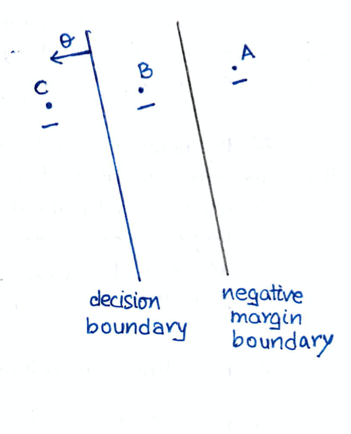

# Lecture 3 Hinge loss, Margin boundaries and Regularization


## Objective

### Hinge loss, Margin boundaries, and Regularization

At the end of this lecture, you will be able to

* Understand the need for maximizing the margin

* Pose linear classification as an optimization problem

* Understand hinge loss, margin boundaries and regularization


# Linear Classification

In the previous lectures, we discussed the idea of finding a hyperplane (line in 2d) that can classify our points. We also are equipped with an algorithm called the Perceptron, that will find a solution if the test set Sn is linearly seprable. 

However we never talked about how good the solution is. For example look at the following figure


Three choices are plotted for a traning set. As we can clearly see that the set is linearlyu separable. So we don't want something like decision boundry A to be our choice because clearly  we have better classifiers, like B and C.

Even if we run our perceptron here, we will find a line like B or C or any other line that seperates **AL** points correctly.

So A is out of the question. Lets look at choice B AND C


Now somehow intuitively we feel that choice C is a better choice than choice B. And the reasonis simple. The choice B is just grazing a point labelled +1. Ie, a point is very close to the decission boundry B, while all the points seem to be at a moderate distancefrom choice C.

We are doing all this calculation in order for us to classify new points.
Suppose some new cases from the test set are such that they are located in the vicinity of this +1 label point, that is very close to the decission boundry.

These points must clearly have label +1 because, they are very close to a feature vector with +1 label. (This is not a robust claim, just a logical assumption), But we see that our choice B will misclassify many such test cases.

However chooice C is still far far away from these points, and therefore it will properly classify them

So we need to understand how these delicates plau out in mathematical terms, but before that we need...


## MATHEMATICAL INTERLUDE: Distance between line and point


Throughout this lecture, we willuse the concept of distance in order to formulate our problem. Lets see how the distance between a line and a point is calculated.

Although we are finding the distance between a line and a points, the procedure we will use and the result we obtained is the general for for distance between a point in ℝᵈ and a hyperplane in ℝᵈ given by 𝜣 ﹒x + 𝜣₀ = 0

Lets start 


So the problem is simple. we have a point P and we denote it vectorily as ẋ₀.
We wish to find its **PERPENDICULAR** distance from the line with equation 𝜣 ﹒ẋ + 𝜣₀ = 0

* We draw a vector starting from the line at A and meeting point P. This vector ĀP will be perpendicular to the line

* There's only one direction perpendicular to the line. That is 𝜣's direction. Therefore we can say that  ĀP is a multiple of 𝜣, ie ĀP = ℷ𝜣 where ℷ ∈ℝ

* Now by vector addition ȰA + ĀP = ȰP. ȰP is ẋ₀ by definition and ĀP = ℷ𝜣 decided above

* So we have ȰA = ẋ₀ - ℷ𝜣

* But the point A lies on the line 𝜣 ﹒ẋ + 𝜣₀ = 0 so ȰA vector should satisfy the equation, ie : 𝜣 ﹒ȰA + 𝜣₀ = 0

* This gives us 𝜣 ﹒(ẋ₀ - ℷ𝜣) + 𝜣₀ = 0 ⟹  ℷ = 𝜣 ﹒ẋ₀ + 𝜣₀ / ||𝜣||²

* Finally we can get the distance between P and the line by finding the length of vector ĀP


So finally we have 


Note that during the derivation, we never mentioned d the dimension we are in. All equations we used were in vector form. So this is a formular in general for perfendicular distance between a point in ℝᵈ and hyperplane: 𝜣 ﹒x + 𝜣₀ = 0

Now that this is out of the way we are ready to tackle our problem.


## Learning as Optimisation


now we had the problem where we had to find a decission boundry given the traning data. We will now see this problem with a different perspective.
We will find 𝜣 and 𝜣₀ taht will minimise something, This is a common practice in MAths and we will do that. But forst we will set the problem up.


We have the traning points below, and instead of fitting / finding just one decision boundry, we will fit a broad thick boundry inbetweenthe points as shown

* The right line (or hyperpolane) that's close to -1 labelled points is called negative margin boundry
* The left line (or hyperplane) that's close to the +1 labelled points is called the possitive margin boundry


The idea is simple : The actual decision boundry will lie slightly inbetween the left and right margin boundry. Note that all these three boundries are parallel to each other


If you wish to see it another way, here is the idea. We will have our decision boundry, and parallel to it will be two more boundries, one on each side. we will somehow strech these two boundries along 𝜣's direction and see how our problems solution can be found in an optimal way


## Linear Classification : Margin

Lets now try to write the equation of these margin boundries. Forst we must note that these are just lines (hyperplanes in general) that are parallel to our decission boundry 𝜣 ﹒x + 𝜣₀ = 0.
So the normal vector for all boundries, decision(one) and margin(two) will be the same direction


So we can with confidence say that the equation of margin boundries will be of the form 𝜣 ﹒x + c = 0.
	- C is some real value and will differ for possitive and negative margin boundries


Now for  given 𝜣 vector and 𝜣₀, that is for a given  decision boundry. We want two lines (hyperplanes generally). that are parallel to the decission boundry. One we impose (by construction) this parallality conditioin it's fixed that the equasions of margins will be of form 𝜣 ﹒x + c = 0

Now note that we only have one more constraint left for these margin boundries and that is c. Once the c is fixed they are fixed, amd thet can't move towards or away from decision boundry along 𝜣 vector.

And now out of nowhere we clain that the equation of margins are:

	* Positive margin classifier : 𝜣 ﹒x + 𝜣₀ = 1
	* Negative margin classifier : 𝜣 ﹒x + 𝜣₀ = -1

WHY?

how can we say that? What about the idea of moving these margins along 𝜣 vectors direction in order to find a good margin classifier? 
It seems that we have fixed the margins once we assign the above two equations to the two margins respectively

But before we rush to judgement lets just try to find the perpendicular distance between any of the margin boundry and the decision bounry.

We already know the distance of point with x₀ from line 𝜣 ﹒x + 𝜣₀ = 0 is 


We can use this trick to find the distance between

* Line 1 : 𝜣 ﹒x + 𝜣₀ = 0
and
* Line 2 : 𝜣 ﹒x + 𝜣₀ = 1


**The idea si as following**

Finding the distance between line 1 and line 2 is equivalent to finding the perpendicular distance between **ANY** point on line 2, and line 1. We can take any point on line 2 because, line 1 and line 2 are parallel, so the distance between and point on line 2, to that of line 1 will be the distance between the two lines


So lets take a general point on pline 2 with vector V₀. 
The distance between V₀(point) and line 1 will be


Now vector V₀ lies on line 2 so it must satisfy
```
	𝜣 ﹒V₀ + 𝜣₀ = 1
```

Substituting we get the distance between line 1 and line 2 that is
```
	  1
	-----
	||𝜣||
```

if we wanted to find the distance between 𝜣 ﹒x + 𝜣₀ = -1 and line 1.
It would similiarly be 


which means both margins are equidistant from the decission boundries and the distance is
```
	  1  
	-----
	||𝜣||
```

And thats what we wanted. GOOD!


So here is the picture we finally have 


### Here is the solution to our problem!!!


We did nothing wrong , the choice to take the equations 	
* 𝜣 ﹒x + 𝜣₀ = 1
* 𝜣 ﹒x + 𝜣₀ = -1

Still allows us to move teh margin boundries, because we haven't fixed ||𝜣|| yet.
This is the extra degree of freedomn we talked about in leacture 2. For example, look at these cases below


In all of the above cases the equation of decission boundry is the same


So the direction of the 𝜣 vector remains unchanged. However, the distance between the margin line and the desision line changes when 𝜣 is multiplied by some factor

Now we can look back about what we did earlier. We said that say, the positive margin boundry is parallel to the decission boundry. So it's equation is of form:
```
	𝜣 ﹒x + c = 0	I cant take a new constant 'c' and without loss of genrallity, write
	𝜣 ﹒x + c(𝜣₀-1) = 0	I can divide by 'c'
	𝜣/c ﹒x + 𝜣₀ -1 = 0
```

and we would again given the argument that there is no unique equation for this plane. We may as well write the equation as
```
	𝜣 ﹒x + 𝜣₀ -1 = 0 ⟹  𝜣 ﹒x + 𝜣₀ = 1
```

But this argument can only be given when we don't care about the norm of the normal vector 𝜣, which is our extra degree of freedom.


## Linear Classification : Margin


Now it's time to develope the idea properly. Let me provide an intuitive feel oif what we are doing.

We had a problem of seperating points with two labels +1 and -1. So we proposed taht we can for the simplest case divide the region into two parts using a line which we call the decision boundry.
The idea was that points to one side of the boundry will be labelled +1 and to the otherside -1.

 


Now look at the image above. The idea in itself is not so bad, but one might say that it's absurd for points that are very closeto the boundry.

So a point just to the leftwill be labelled +1
And a point to the right will be labelled -1

Thats not robust at all, just a small deviation of points near the boundry, and the label changes abruptly.

So someone suggested that there must be some **margin** for a boundry like this, within which points can be properly labelled.

Therefore came the concept of margin boundries. We will not only fot a single decission boundry, but two margin boundries with this decision boundry.
It would be like fitting a thick decission boundry. We will also try to fit the margin boundries such that no or minimum points lie inside this thick boundry so that we can with confidence say that the points to the right of negative margin boundry should be labelled -1 and the points to the left of possitive margin boundry should be labbeled +1


The plan was to strech these margins along 𝜣's direction (nagative and possitive) in order to make the width (both neg and pos margin) as wide as possible.

This means we want to maximise the distance between the positive/negative margin and the decision boundry
```
ie,
	  	   1
	maximise -----
	         ||𝜣||

	Or minimise ||𝜣||
```

If you want to maximise the distance between boundries, why dont we just |i| one boundry to +oo and other to -oo. the distance between them will be 1/2∘00 = 0, the minimum possible? 

This is a bad idea and heres why


As the distance between margins will increase. More and more points will start to come inside the fat margin. That would defeat the whole purpose of having a fat margin. We may allow some points inside but not a lot.

So this brings us to a dilemma. We want to maximise trhe distance between the two margins, but doing this starts taking in points inside the fat boundry

This is the issue of regularisation and loss

### Regularisation vs Loss

It's not sufficient to tackle the problem of finding these margin boundries as by maximising |/||𝜣|| 
This is the regularisation term that will aim for a boundry of maximum width 1/||𝜣||. We see a counter force that will be emerging as the margins widen. This will graphically manifest itself as more points falling inside he fat boundry. It will be manifested in mathmatical terms, in form of a loss function 

So we will add these two functions and try to optimise/minimise that overall function in order to find optimal 𝜣 and 𝜣₀

We will call this function the objective function
```
			      Some terms     some terms
	Objective function =  contaning	  +  contaning
			      Loss part      regularization part
```

The regulization part is a no brainer. We wanted to maximise the distance between the boundries, which is equivelant to maximising ||𝜣||.
So the term should be proportional to ||𝜣|| in the objective function. (or something of this form)

The loss function is what wer haven't talked about until now so...

## The Loss Function

So the idea is pretty simple. We want to penalize points.
To each point we will assign  loss. Look at it this way, suppose we have three points with the label -1 as shown, ie A, B, C



* A : Is -1 labblled point that is far away from the decission boundry. It's even to the right of nagative margin boundry. There is no need for us to penalize A as its far away in the right direction.It can be labelled -1 with a lot of confidence

* B : Now this point is  NOT misclassified. it's still to the right of the decission boundry but it's not to the right of the negative margin boundry. So a point between the margin and the decision boundry should be penalised. Also it's apparent that the more close B gets to the decission boundry, the more problem we will have classifying it correctly. So the penalization should increase as the point gets close to the decision boundry

* C : Now this is out of control. Not only is point C inside the margin boundry, it's also inside (to the left of) the decision boundry. It is a misclassified point (by our own decision boundry). One might say, 'why dont we adjust the three boundries such that it's (the point) correctly classified?' Well we could have done that if the data we have is linearly seperable, but that's not always the case. So we will have to account for losses from these points too. We will have to penalize them even more strongly than the previous two points. This whole analysis can be done with +1 labelled points and positive margin boundaries too. Now.

We have been talking about penalizing points but what does punishing the points mean? 

what we are trying to say is simple. We, for a given 𝜣 and 𝜣₀, will go to each of the n points and see how each point contributes to an error or loss. Just like above, we will assign each point a loss, and add these up. This will let them form a part of our objective function earlier. And that objective function will be minimised with 𝜣 and 𝜣₀. Thus inding proper boundries.

How do we write this Loss Function mathematically? Lets see...


First we must not whats important and whats not


Here I have drawn 3 cases when, the point sthat we want to penalize are equidistant from th decision and margin boundry. Which is to say taht they are at equal **PERPENDICULAR** distance from the boundry.
There placement along the direction parallel to the boundries may vary, but the perpendicular distance will be the same.

But we are interested in classification, so why do we care if the point is anywhere along the parellel direction to the boundries. the only thing we care about is how close or far from the decision boundry is the point, ie we care only about the **PERPENDICULAR** distance of a point from the decision boundry in order to decide how much to penalize it
Points with equal perpendicular distance from the decision boundry will be penalized equally, no matter what their position isalong the direction parallel to the line

We already know the expression for a points distance from a line (hyperplane)

The distance of a point with vector x⁽ⁱ⁾ from the line(hyperplane) : 𝜣∘x+𝜣₀=0 is
```
	|𝜣∘x⁽ⁱ⁾ + 𝜣₀|
	-------------
	    ||𝜣||
```


But this is the notion of distance, we want a thing that will tell us the classification of the point too. We in lecture 2 saw that this quantity


we will introduce the notion of signed distance


Now this is a quantity that will tell us not only the perpenducular distance of the ith point from the line, but also whether the point is misclassified or not. Note that

 

Now y⁽ⁱ⁾ = 1 or -1 so |y⁽ⁱ⁾| = 1

Therefore |yi(𝜣,𝜣₀)| = distance (orthangonal) of the ith point from the line

But when yi|𝜣,𝜣₀) > 0, we know we are talking about a correctly classified point

or when yi|𝜣,𝜣₀) ≦ 0,We know we are talking about a misclassified (error included at 0) point

With this being defined, we will define another quantity to help our intuition.


## Agreement


Agreement is defined as: y⁽ⁱ⁾(𝜣∘x⁽ⁱ⁾+𝜣₀)

This is **NOT** a new thing, we already studied this earlier. But if we look closely enough, we find that this quantity has an all together new meaning, in the light of what we did in this lecturre. Let me elaborate.

First lets recall that the distance between possitive **OR** negative margin boundry to thatof the decision voundry is 1 / ||𝜣||. We derived that earlier

now look at the signed distance


So basically

Agreement = ||𝜣|| * signed distance

We also know distance between a margin boundry and decission boundry = 1\||𝜣||


o agreement is the ratio between the two distances. Lets denote agreement by 
```
	z : y⁽ⁱ⁾(𝜣∘x⁽ⁱ⁾+𝜣₀)
```

This means we have a way of seeing, how the ithpoint is placed with the margin. We can say that the ith point is
```
	Z times away from the decision boundry compared margin boundry
```

Because distance of point i from the decision boundry = z * distance of margin boundry from the dicision boundry


Let me illistrate with some cases, here we have a fixed 𝜣 and 𝜣₀ for all the cases and we want to see what agreement means.


Here a -1 labelled point is ot the right side of the decision boundry so yi(𝜣,𝜣₀) will be positive. We can also see that it's well beyond negative margin boundry therefore yi(𝜣,𝜣₀) > 1/||𝜣|| for this case.

Therefore the agreement will be much larger than 1, ie we strongly agree when the point is to the correct side and well beyond margin boundry


Here the -1 labelled point lies in between the decision boundry and the negative margin boundry. the point is still classifies correctly. So yi(𝜣,𝜣₀) > 0, but we clearly see taht yi(𝜣,𝜣₀) < 1/||𝜣|| for this case

Therefore the agreement will be smaller than 1, but bigger than 0 for this case. So when the point  is in between the mergin (nagative for -1, positive for +1), we will somewhat agree and the agreement z will be between 0 and 1


Here the -1 labelled point lies beyond the decission boundry. ie it's missclassified. So yi(𝜣,𝜣₀) < 0. So the agreement z will also be negative. So the negative agreement will be a disagreement... the point is on the wrong side, we disagree.

As a point moves more and more away from the decision boundry in the wrong direction, our disagreement will become more and more strong.
Ie, agreement will go from 0 to -oo as point goes to the left.

This all can be done with a positive boundry and +1 labelled points too.


## Hinge Loss


Once we have defined our agreement z, we will penalize our points on basis of this z. We will choose a function


